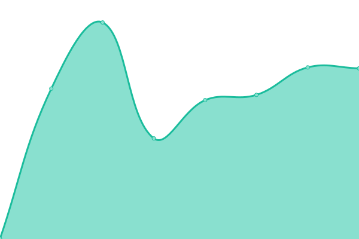

# [📈 Live Status](https://status.dogcraft.top): <!--live status--> **🟧 Partial outage**

This repository contains the open-source uptime monitor and status page for [dogcraft](https://www.neko.red/about/), powered by [Upptime](https://github.com/upptime/upptime).

With [Upptime](https://upptime.js.org), you can get your own unlimited and free uptime monitor and status page, powered entirely by a GitHub repository. We use [Issues](https://github.com/ybw2016v/status/issues) as incident reports, [Actions](https://github.com/ybw2016v/status/actions) as uptime monitors, and [Pages](https://status.dogcraft.top) for the status page.

<!--start: status pages-->
<!-- This summary is generated by Upptime (https://github.com/upptime/upptime) -->
<!-- Do not edit this manually, your changes will be overwritten -->
<!-- prettier-ignore -->
| URL | Status | History | Response Time | Uptime |
| --- | ------ | ------- | ------------- | ------ |
|  [BLOG](https://art.dogcraft.top) | 🟥 Down | [blog.yml](https://github.com/ybw2016v/status/commits/HEAD/history/blog.yml) | 

 519ms
     
 | 

<a href="https://status.dogcraft.top/history/blog">0.00%</a>
    

|  [DMI](https://m.dogcraft.top) | 🟩 Up | [dmi.yml](https://github.com/ybw2016v/status/commits/HEAD/history/dmi.yml) | 

 906ms
     
 | 

<a href="https://status.dogcraft.top/history/dmi">100.00%</a>
    

|  [misskey](https://m.dogcraft.cn) | 🟩 Up | [misskey.yml](https://github.com/ybw2016v/status/commits/HEAD/history/misskey.yml) | 

 1560ms
     
 | 

<a href="https://status.dogcraft.top/history/misskey">100.00%</a>
    

|  [GIT](https://git.neko.red) | 🟩 Up | [git.yml](https://github.com/ybw2016v/status/commits/HEAD/history/git.yml) | 

 1470ms
     
 | 

<a href="https://status.dogcraft.top/history/git">100.00%</a>
    

|  [Vaultwarden](https://e.neko.red) | 🟩 Up | [vaultwarden.yml](https://github.com/ybw2016v/status/commits/HEAD/history/vaultwarden.yml) | 

 1377ms
     
 | 

<a href="https://status.dogcraft.top/history/vaultwarden">100.00%</a>
    

<!--end: status pages-->

[**Visit our status website →**](https://status.dogcraft.top)

## 📄 License

- Powered by: [Upptime](https://github.com/upptime/upptime)
- Code: [MIT](./LICENSE) © [dogcraft](https://www.neko.red/about/)
- Data in the `./history` directory: [Open Database License](https://opendatacommons.org/licenses/odbl/1-0/)
